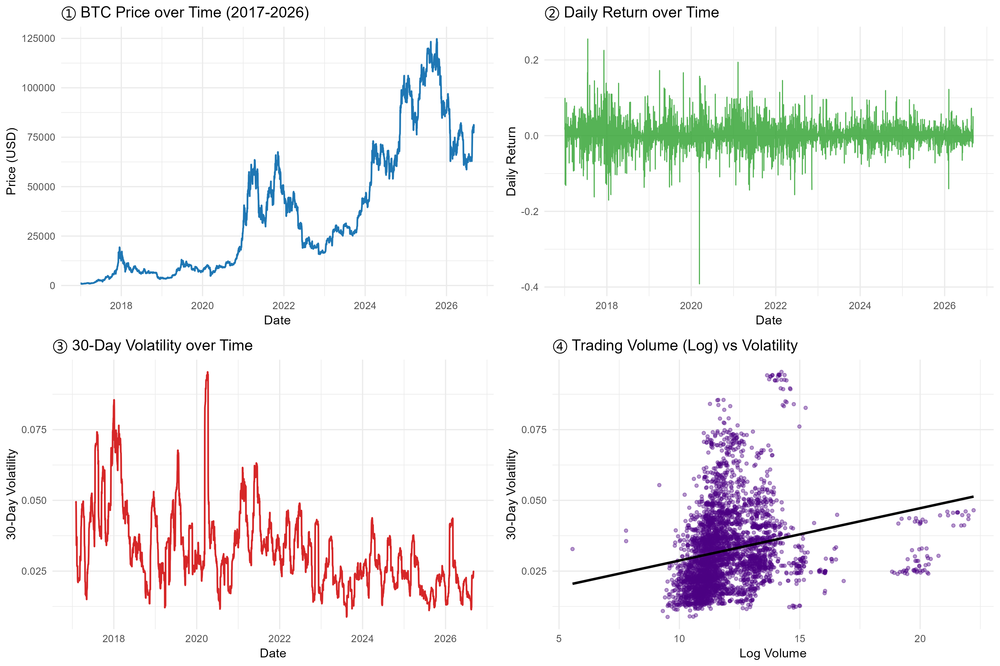

# Empirical Analysis of Bitcoin Trading Volume and Market Volatility (2017–2026)

An empirical econometric project testing the **Mixture of Distributions Hypothesis (MDH)** in Bitcoin markets across $N = 3,534$ daily observations (2017–2026).

---

## 📌 Executive Summary
This study investigates the information-arrival mechanism in cryptocurrency markets by testing whether daily trading volume ($V_t$) acts as a driver for 30-day rolling market volatility ($Vol_t$). Using long-horizon historical data, we apply baseline OLS regression and correct for severe heteroskedasticity and autocorrelation using **Newey-West HAC robust standard errors** ($\text{lag} = 7$).

---

## 📊 Key Diagnostics & Findings

### 1. Descriptive Statistics
| Metric | Value | Academic & Financial Interpretation |
| :--- | :--- | :--- |
| **Mean Daily Return ($R_t$)** | 0.1882% | Positive average compounding daily price growth across full market cycles. |
| **Max Daily Return** | 25.56% | Extreme right-tail market expansion day. |
| **Min Daily Return** | -39.18% | Severe left-tail liquidity shock (March 12, 2020 "Black Thursday" crash). |
| **Mean 30-Day Volatility** | 3.24% | Baseline daily standard deviation (~61.9% annualized across the 9.6-year horizon). |
| **Mean Daily Volume** | 17,474,767 | Average daily trading liquidity flow. |
| **Peak Volatility Period** | 2020-04-06 (9.54%) | All-time highest market uncertainty period following systemic liquidity shocks. |

### 2. Econometric Models & Robust Standard Errors
* **Baseline OLS Model:**
  $$Vol_t = \alpha + \beta_1 V_t + \varepsilon_t$$
  * Unadjusted Estimate: $\beta_1 = 0.00185$, $t = 12.880$, $p < 2.2 \times 10^{-16}$, $R^2 = 4.52\%$.
* **Diagnostic Tests:**
  * **Breusch-Pagan Test (Heteroskedasticity):** $BP = 83.04, p < 2.2 \times 10^{-16}$ (Rejects homoskedasticity).
  * **Durbin-Watson Test (Autocorrelation):** $DW \approx 0.0315, p < 2.2 \times 10^{-16}$ (Confirms severe positive residual autocorrelation).
* **Newey-West HAC Correction ($\text{lag} = 7$):**
  * Adjusted Standard Error: $0.000415$ ($t = 4.4565, p = 8.59 \times 10^{-6}$).
  * **Conclusion:** Standard OLS underestimated the true standard error by ~245%. After correcting for autocorrelation and heteroskedasticity, volume remains a statistically significant driver ($p < 0.001$) of market volatility, supporting the MDH framework.

---

## 📂 Repository Structure
* `btc_mdh_econometric_analysis.R`: Full executable R code containing data cleaning, variable engineering, diagnostic checks, and ggplot2 dashboard visualization.
* `Empirical Analysis of Bitcoin Trading Volume and Market Volatility.pdf`: Formal, 4-page publication-ready PDF report.
* `btc_diagnostic_charts_2017_2026.png`: 300 DPI high-resolution diagnostic plot.

---

## 🛠 Tools & Methodology
* **Language:** R (packages: `ggplot2`, `lmtest`, `sandwich`, `tseries`)
* **Time-Series Analysis:** Log-returns, 30-day backward-looking standard deviation, logarithmic scale transformation.
* **Econometrics:** OLS Regression, Breusch-Pagan Test, Durbin-Watson Test, Newey-West HAC Adjustment.
